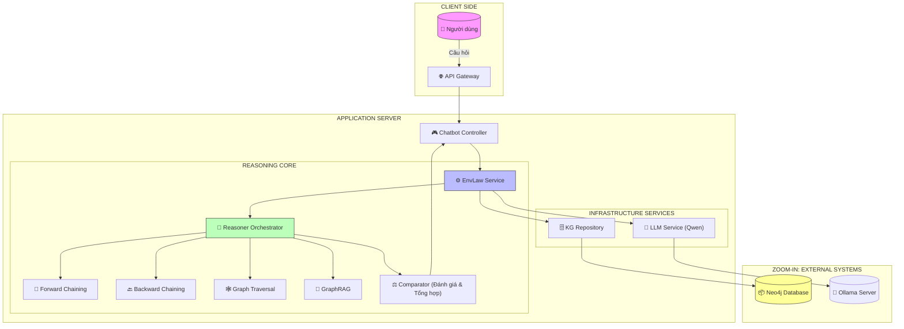
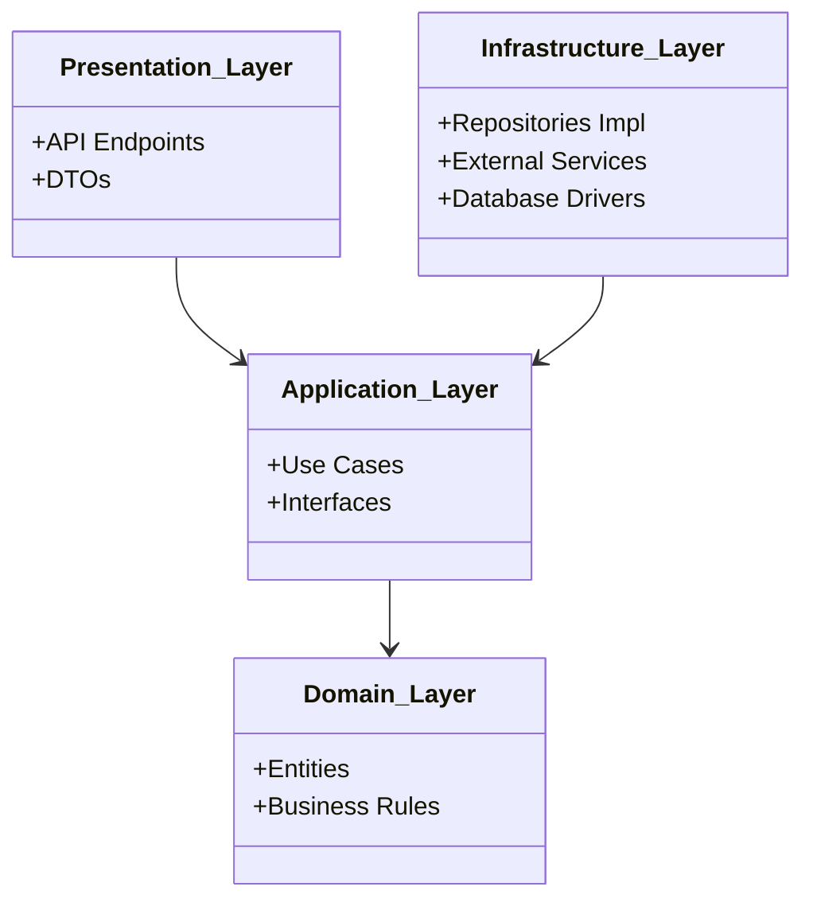
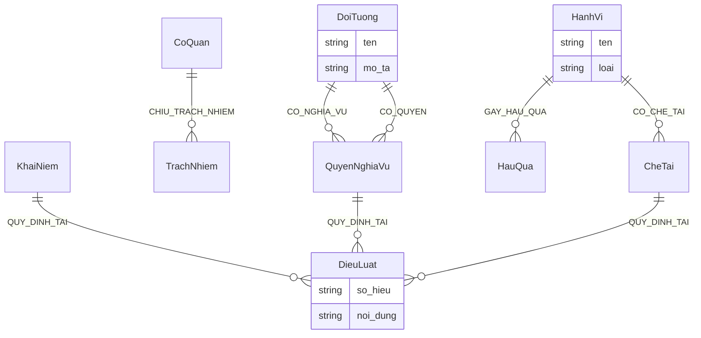
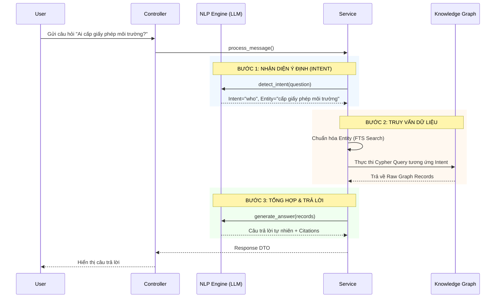

# BÁO CÁO CHI TIẾT KIẾN TRÚC & KỸ THUẬT HỆ THỐNG CHATBOT LUẬT MÔI TRƯỜNG 2020

**Dự án:** Hệ thống Hỏi đáp Pháp luật Tự động (Legal QA System)
**Phiên bản:** 3.0 (Multi-Reasoner Arcitechture)
**Ngày báo cáo:** 20/12/2025

---

## MỤC LỤC

1.  [Tổng Quan Hệ Thống](#1-tong-quan-he-thong)
2.  [Kiến Trúc Phần Mềm (Clean Architecture)](#2-kien-truc-phan-mem-clean-architecture)
3.  [Mô Hình Dữ Liệu Knowledge Graph](#3-mo-hinh-du-lieu-knowledge-graph)
4.  [Hệ Thống Suy Diễn Đa Chiến Lược (Multi-Reasoner)](#4-he-thong-suy-dien-da-chien-luoc-multi-reasoner)
5.  [Workflow Xử Lý Câu Hỏi](#5-workflow-xu-ly-cau-hoi)
6.  [Kỹ Thuật Hỏi Đáp Chuyên Sâu](#6-ky-thuat-hoi-dap-chuyen-sau)
7.  [Kết Luận & Hướng Phát Triển](#7-ket-luan--huong-phat-trien)

---

## 1. TỔNG QUAN HỆ THỐNG

### 1.1. Giới thiệu

Hệ thống Chatbot Luật Môi trường 2020 là một giải pháp ứng dụng AI kết hợp **Knowledge Graph (Đồ thị tri thức)** và **Large Language Model (LLM)** để giải quyết vấn đề tra cứu và tư vấn pháp lý tự động. Điểm đặc biệt của hệ thống là khả năng **suy diễn logic** dựa trên các quy tắc pháp lý (Legal Reasoning) thay vì chỉ tìm kiếm văn bản đơn thuần, đảm bảo tính chính xác và luôn trích dẫn căn cứ pháp luật cụ thể.

### 1.2. Công nghệ Cốt lõi

- **Knowledge Graph (Neo4j):** Lưu trữ văn bản luật dưới dạng các thực thể (Entities) và quan hệ (Relationships) như: _Đối tượng -[CÓ_NGHĨA_VỤ]-> Nghĩa vụ_, _Hành vi -[CÓ_CHẾ_TÀI]-> Mức phạt_.
- **Local LLM (Qwen via Ollama):** Đóng vai trò là bộ xử lý ngôn ngữ tự nhiên (NLU) để hiểu ý định người dùng và định dạng câu trả lời (NLG), không tham gia vào việc "nhớ" kiến thức để tránh ảo giác (hallucination).
- **Multi-Reasoner Engine:** Bộ máy suy diễn trung tâm gồm 6 chiến lược suy luận khác nhau chạy song song hoặc tuần tự tùy theo ngữ cảnh.
- **Backend:** Python (FastAPI/AsyncIO) với kiến trúc Clean Architecture.

### 1.3. Sơ đồ Kiến trúc Tổng quan (High-Level Architecture)

---

## 2. KIẾN TRÚC PHẦN MỀM (CLEAN ARCHITECTURE)

Hệ thống được xây dựng tuân thủ nghiêm ngặt nguyên lý **Clean Architecture** để đảm bảo tính độc lập, dễ bảo trì và mở rộng.

### 2.1. Phân tầng chi tiết

1.  **Domain Layer (Lõi):**

    - Chứa các Entities: `MedicalKnowledge` (được tái sử dụng làm `EnvLawKnowledge`), `Message`, `Conversation`.
    - Chứa các Interfaces (Ports) cho Repository.
    - **Đặc điểm:** Không phụ thuộc vào bất kỳ framework nào bên ngoài.

2.  **Application Layer (Use Cases):**

    - Chứa logic nghiệp vụ ứng dụng: `EnvLawChatbotService`.
    - Điều phối luồng dữ liệu giữa UI và Entities.
    - Xử lý logic Orchestrator cho các Reasoners.

3.  **Infrastructure Layer (Cơ sở hạ tầng):**

    - Triển khai các Interfaces: `KnowledgeGraphRepositoryImpl`, `LocalLLMService`.
    - Kết nối trực tiếp với Neo4j và Ollama.
    - Chứa các thư viện hỗ trợ (Utils, Logging).

4.  **Presentation Layer (Giao diện):**
    - API Endpoints (FastAPI) tiếp nhận request từ người dùng.
    - Chuyển đổi dữ liệu (DTO) và gọi xuống Application Layer.

---

## 3. MÔ HÌNH DỮ LIỆU KNOWLEDGE GRAPH

Dữ liệu luật được mô hình hóa thành một đồ thị tri thức phong phú, cho phép truy vấn semantic (ngữ nghĩa) thay vì chỉ keyword matching.

### 3.1. Các loại Node (Labels)

- **`DoiTuong`**: Chủ thể chịu tác động hoặc thực thi luật (VD: Doanh nghiệp, Bộ TNMT, Cá nhân).
- **`HanhVi`**: Các hành động cụ thể (VD: Xả thải, Lập báo cáo ĐTM, Nhập khẩu phế liệu).
- **`QuyenNghiaVu`**: Nội dung quyền hoặc nghĩa vụ (VD: Phải có giấy phép môi trường).
- **`CheTai`**: Hình thức xử phạt (VD: Phạt tiền từ 10-20 triệu đồng).
- **`DieuLuat`**: Căn cứ pháp lý (VD: Điều 29 Luật BVMT 2020).
- **`KhaiNiem`**: Các định nghĩa, thuật ngữ.

### 3.2. Sơ đồ Quan hệ (Relationships Schema)

---

## 4. HỆ THỐNG SUY DIỄN ĐA CHIẾN LƯỢC (MULTI-REASONER)

Đây là "bộ não" của hệ thống, cho phép xử lý các loại câu hỏi phức tạp khác nhau bằng các thuật toán chuyên biệt. Hệ thống sử dụng mẫu thiết kế **Strategy Pattern** được quản lý bởi một **Orchestrator**.

### Danh sách các Reasoners:

1.  **Forward Chaining Reasoner (Suy diễn tiến):**

    - _Mục đích:_ Tìm ra tất cả hệ quả từ một sự kiện/đối tượng ban đầu.
    - _Ứng dụng:_ Câu hỏi "Doanh nghiệp xả thải thì bị làm sao?", "Chủ dự án có nghĩa vụ gì?".
    - _Cơ chế:_ Từ Facts ban đầu -> Áp Rules -> Tạo ra Facts mới -> Lặp lại cho đến khi không còn rule nào thỏa mãn.

2.  **Backward Chaining Reasoner (Suy diễn lùi):**

    - _Mục đích:_ Kiểm chứng một giả thuyết.
    - _Ứng dụng:_ Câu hỏi Yes/No ("Doanh nghiệp có được nhập khẩu phế liệu không?").
    - _Cơ chế:_ Giả sử Goal là đúng -> Tìm Rule dẫn đến Goal -> Kiểm tra điều kiện của Rule -> Tiếp tục lùi lại các Facts cơ sở.

3.  **Graph Traversal Reasoner:**

    - _Mục đích:_ Tìm mối liên hệ xa giữa các thực thể thông qua việc duyệt đồ thị.
    - _Ứng dụng:_ Tìm đường đi từ "Hành vi" đến "Điều luật" thông qua các node trung gian.

4.  **GraphRAG Reasoner (Hybrid):**
    - _Mục đích:_ Sử dụng LLM để đọc hiểu các node văn bản dài (unstructured) kết hợp với cấu trúc đồ thị.
    - _Ứng dụng:_ Câu hỏi so sánh, định nghĩa phức tạp, tổng hợp thông tin.

---

## 5. WORKFLOW XỬ LÝ CÂU HỎI

Quy trình xử lý một câu hỏi của người dùng đi qua các bước sau (Pipeline):

### Chi tiết các bước:

1.  **Phân tích (NLU Analysis):** Sử dụng `regex` kết hợp LLM để xác định Intent (Mục đích) và Entity (Thực thể).
    - Sử dụng regex ưu tiên để bắt các pattern cứng (VD: "...có phải không").
    - Dùng LLM để phân tích ngữ nghĩa sâu hơn nếu regex thất bại.
2.  **Chuẩn hóa (Normalization):** Sử dụng Full Text Search (FTS) để ánh xạ entity người dùng nhập (VD: "đtm") sang tên chuẩn trong KG (VD: "Báo cáo đánh giá tác động môi trường").
3.  **Định tuyến (Routing):** Dựa vào Intent, gọi Reasoner phù hợp.
4.  **Kiểm chứng (Verification):** (Đối với câu hỏi Yes/No) So sánh Claim với Evidence tìm được.

---

## 6. KỸ THUẬT HỎI ĐÁP CHUYÊN SÂU

Hệ thống sử dụng các kỹ thuật xử lý riêng biệt cho từng loại câu hỏi để đạt độ chính xác cao nhất cho miền pháp luật.

### 6.1. Kỹ thuật xử lý câu hỏi xác thực (Yes/No Questions) -> QUAN TRỌNG

Đây là loại câu hỏi khó nhất vì đòi hỏi tư duy logic "Đúng/Sai".

- **Logic:** Two-step Verification (Xác thực 2 bước).
- **Workflow:**
  1.  **Phân rã:** Tách câu hỏi thành `Subject` (Chủ thể) và `Predicate` (Mệnh đề cần kiểm tra).
  2.  **Truy xuất:**
      - Tìm `Subject` trong KG.
      - Tìm tất cả quan hệ `CO_NGHIA_VU`, `CO_QUYEN`, `BI_CAM` của Subject.
  3.  **So khớp (Strict Comparison):** Dùng LLM (temp=0.0) để so sánh Mệnh đề cần kiểm tra với dữ liệu thật.
      - _Ví dụ:_ Hỏi "Doanh nghiệp có phải lập ĐTM không?". Dữ liệu KG: "Doanh nghiệp -> [CÓ_NGHĨA_VỤ] -> Lập ĐTM". -> Kết luận: **CÓ**.
  4.  **Giải thích:** Nếu câu trả lời là "Không", hệ thống sẽ chỉ ra lý do (VD: "Không tìm thấy quy định này" hoặc "Luật quy định khác...").

### 6.2. Kỹ thuật xử lý câu hỏi "Ai/Cơ quan nào" (Who/Agency)

- **Logic:** Reverse Inference (Suy diễn ngược từ hành động ra chủ thể).
- **Workflow:**
  1.  Trích xuất hành động/nhiệm vụ `X` (VD: "cấp giấy phép").
  2.  Truy vấn ngược: Tìm tất cả node có quan hệ `-> [THUC_HIEN] -> X` hoặc `-> [CHIU_TRACH_NHIEM] -> X`.
  3.  Tổng hợp danh sách các chủ thể thỏa mãn.

### 6.3. Kỹ thuật xử lý Hậu quả pháp lý (Consequence Chains)

- **Logic:** Forward Chaining đa bước.
- **Workflow:**
  1.  Xác định `HanhVi` vi phạm (VD: "Xả thải trái phép").
  2.  Tìm `CheTai` trực tiếp (`HanhVi -> CheTai`).
  3.  Tìm `HauQua` gián tiếp (`HanhVi -> TacDong -> HauQua`).
  4.  Trả về chuỗi nhân quả đầy đủ: Hành vi -> Vi phạm điều nào -> Bị phạt gì -> Khắc phục ra sao.

---

## 7. KẾT LUẬN & HƯỚNG PHÁT TRIỂN

### 7.1. Kết luận

Hệ thống Chatbot Luật Môi trường 2020 đã xây dựng thành công kiến trúc **Multi-Reasoner** trên nền tảng **Clean Architecture**. Việc tách biệt rõ ràng giữa logic suy diễn (Rules/Code) và kiến thức (Graph) giúp hệ thống minh bạch, dễ giải thích (Explainable AI) và tuân thủ chặt chẽ văn bản luật.

### 7.2. Điểm mạnh

- **Tính chính xác cao:** Luôn có trích dẫn điều luật.
- **Không bịa đặt:** Sử dụng LLM làm format engine, không dùng làm knowledge base.
- **Linh hoạt:** Dễ dàng thêm luật mới bằng cách cập nhật KG hoặc Rules mà không cần train lại model.

### 7.3. Hướng phát triển tiếp theo

- Mở rộng bộ Rules cho các nghị định, thông tư hướng dẫn.
- Tích hợp module trích xuất tự động (Information Extraction) để cập nhật KG từ văn bản luật mới.
- Phát triển giao diện trực quan hóa đồ thị (Graph Visualization UI) cho người dùng.

---

_Báo cáo được xây dựng bởi đội ngũ phát triển Deepmind Advanced Agentic Coding - Tháng 12/2025._
